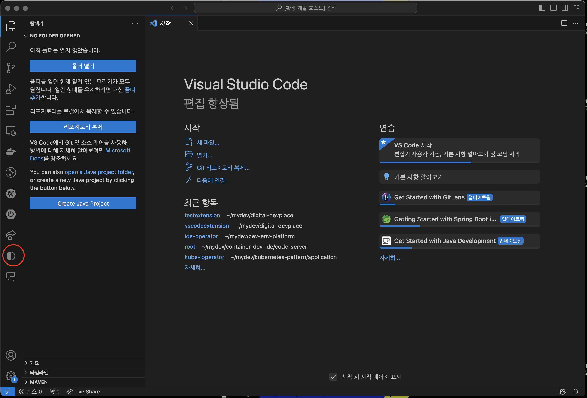
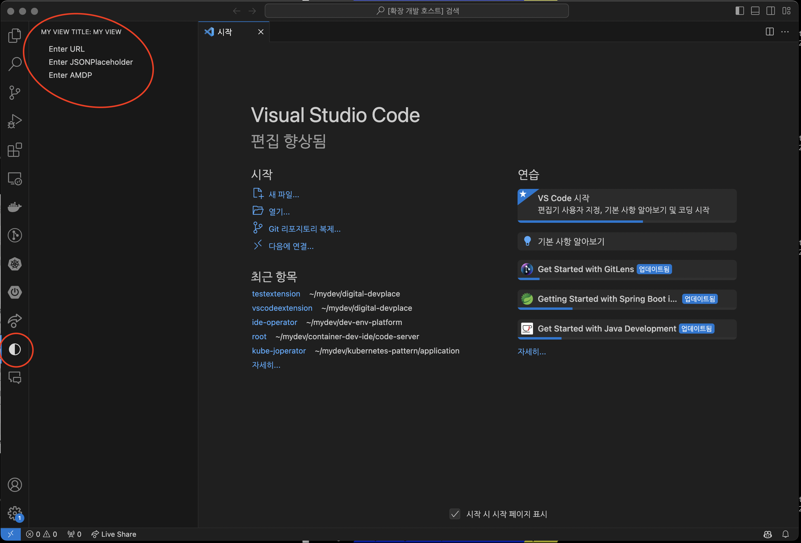
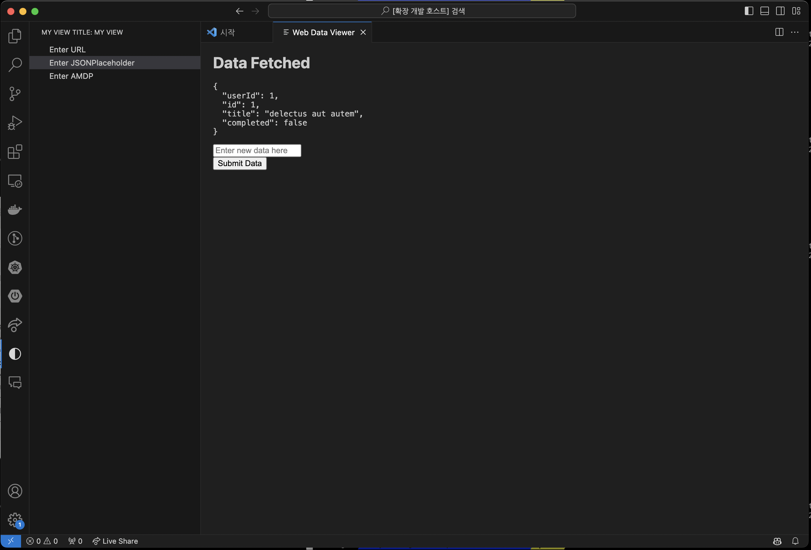

# vscode extension 개발

이 문서는 Visual Studio Code를 위한 사용자용 Custom Extension 개발을 위한 가이드와 샘플코드를 제공합니다.
extension 개발은 기본적으로 extension.js 와 package.json을 기반으로 작성합니다. 

본 문서에서는 VSCODE의 
- Activity bar에 icon을 추가하고,
- Primary sidebar에 3가지 메뉴를 추가 한후 
- 그 결과를 WebView에 표시하는 방법
에 대해 샘플 코드를 작성하여 제공합니다.  


## 사전 요구 사항

- Node.js (최신 LTS 버전 권장)
- npm (Node.js와 함께 설치됨)

## 시작하기

### Yeoman 및 VS Code 확장 생성기 설치

Yeoman과 VS Code extension 생성기를 사용하여 확장의 기본 구조를 빠르게 설정할 수 있습니다.

```bash
npm install --global yo
yo doctor
sudo npm install -g yo generator-code
```

### extension 스캐폴드 생성 및 설정

```bash
yo code
--------
     _-----_     ╭──────────────────────────╮
    |       |    │   Welcome to the Visual  │
    |--(o)--|    │   Studio Code Extension  │
   `---------´   │        generator!        │
    ( _´U`_ )    ╰──────────────────────────╯
    /___A___\   /
     |  ~  |
   __'.___.'__
 ´   `  |° ´ Y `

? What type of extension do you want to create? (Use arrow keys)
  New Extension (TypeScript)
❯ New Extension (JavaScript)
  New Color Theme
  New Language Support
  New Code Snippets
  New Keymap
  New Extension Pack
  New Language Pack (Localization)
  New Web Extension (TypeScript)
  New Notebook Renderer (TypeScript)
  
? What type of extension do you want to create? New Extension (JavaScript)
? What's the name of your extension? vscodeExtension
? What's the identifier of your extension? vscodeextension
? What's the description of your extension? vscode 를 위한 가이드 코드
? Enable JavaScript type checking in 'jsconfig.json'? Yes
? Initialize a git repository? Yes
? Which package manager to use? npm
...
```

```bash
yo code
cd my-extension
npm install
```

## extension 구조

기본적인 extension 구조는 다음과 같으며, 여기에는 소스 코드, 문서화 자료, 아이콘 등이 포함됩니다.
확장의 구조는 다음과 같을 것입니다:

```
my-extension/
│   .vscode/
│   .eslintrc.json
│   .gitignore
│   README.md
│   package.json
│   tsconfig.json
├── src/
│   └── extension.js
├── docs/
│   └── <스크린샷 및 문서>
└── icons/
    └── dark.svg
```

## 개발

extension의 주요 로직은 `./src` 디렉토리에 위치한 `extension.js`에 있습니다. 제공된 코드의 간략한 개요는 다음과 같습니다:

`extension.js`

- `vscode`: VS Code API에 접근하기 위한 모듈입니다.
- `axios`: HTTP 요청을 보내기 위해 사용하는 라이브러리입니다.
- `MyCustomViewProvider` 클래스: TreeView를 구성하기 위해 사용됩니다.
- `activate` 함수: 확장 기능이 활성화될 때 호출되며, 커맨드를 등록하고 뷰를 설정합니다.
- `fetchDataAndShowWebView` 함수: URL로부터 데이터를 가져와 WebView에 표시합니다.
- `createWebViewContent` 및 `createWebViewWithElegant` 함수: WebView에 표시할 HTML 컨텐츠를 생성합니다.

`package.json`

이 파일은 extension의 메타데이터를 포함하고 커맨드, 뷰 등을 정의합니다:

```json
{
  "name": "testextension",
  "displayName": "Test Extension",
  "description": "",
  "version": "0.0.1",
  "engines": {
    "vscode": "^1.86.0"
  },
  ...
}
```

### `사전 설치`

```bash
npm install 
npm install axios
```

### `extension.js` 상세 설명

`extension.js`는 extension 기능의 핵심 로직을 담고 있습니다. 이 파일에서는 VS Code API를 사용하여 사용자 인터페이스 구성요소를 생성하고, 외부 데이터를 가져오며, 사용자 입력을 처리합니다.

- **MyCustomViewProvider 클래스**: 이 클래스는 사용자 정의 뷰를 생성하고 관리합니다. 사용자가 트리 뷰 항목을 클릭할 때 실행되는 커맨드를 정의합니다.
- **activate 함수**: extension 기능이 활성화될 때 실행되는 초기화 코드를 포함합니다. 커맨드 등록 및 뷰 프로바이더 설정이 여기에 포함됩니다.
- **fetchDataAndShowWebView 함수**: 사용자가 제공한 URL로부터 데이터를 가져와 WebView에 표시합니다. 이를 통해 사용자는 웹 데이터를 직접 extension 내에서 볼 수 있습니다.

### `package.json` 상세 설명

`package.json`은 extension 기능의 메타데이터, 의존성, VS Code에 대한 기여(contributes) 등을 정의합니다.

- **name, displayName, description**: extension 기능의 이름, 표시 이름, 설명입니다.
- **activationEvents**: extension 기능이 활성화되는 조건을 정의합니다. 예를 들어, 특정 커맨드가 실행될 때 extension 기능이 활성화될 수 있습니다.
- **contributes**: extension 기능이 VS Code에 기여하는 커맨드, 뷰, 설정 등을 정의합니다. 이는 사용자가 extension 기능을 통해 수행할 수 있는 작업을 결정합니다.

## 테스트 및 스크린샷
vscode에서 왼쪽 Activity Bar 의 `실행 및 디버그`를 선택한 후 `Run Extension`을 실행하면 다음과 같은 화면이 뜬다. 

### 초기 실행 화면
Rune Extension 시 왼쪽 Activity bar에 dark.svg icon이 표시됩니다. 




### Primary Sidebar 화면
3가지 메뉴를 제공하고 있습니다. 
- Enter URL : 선택 시 text box를 표시하며, JSON 데이터를 리턴하는 URL을 등록하면 그 결과를 Windows에 표시합니다. 
  참고로 https://jsonplaceholder.typicode.com/posts 등을 복사한 후 사용하면 됩니다. 
- Enter JSONPlaceholder: https://jsonplaceholder.typicode.com/todos/1 를 호출해서 Window에 표시합니다.
  그리고 text box와 button 예시를 표시합니다. (이 박스는 동작하지 않습니다)
- Enter AMDP : 서비스를 외부 Browser 로 디스플레이 합니다. 




### WebView 화면




## extension 게시
extension 기능을 완성한 후, 이를 VS Code 마켓플레이스에 게시하여 다른 사용자와 공유할 수 있습니다.
### 사전 준비
1. Visual Studio Code extension 개발: extension 기능이 완성되고 충분히 테스트되었는지 확인합니다. 
2. Node.js 설치: VS Code extension 게시 도구를 사용하기 위해 Node.js가 설치되어 있어야 합니다.
3. VSCE(Visual Studio Code Extension CLI) 설치: VSCE는 VS Code extension 패키징하고 게시하는 데 사용되는 명령줄 도구입니다. 다음 명령어로 설치할 수 있습니다.


```bash
npm install -g vsce
```

### extension 패키징
1. 매니페스트 파일 검사: package.json 파일에 extension 기능의 이름, 버전, 게시자 등의 정보가 정확히 입력되어 있는지 확인합니다.
2. 의존성 최적화: 불필요한 파일이나 의존성이 패키지에 포함되지 않도록 .vscodeignore 파일을 설정합니다.
3. extension 패키지 생성: 다음 명령어로 extension 기능의 .vsix 파일을 생성합니다.

```bash
vsce package
```

### 마켓플레이스 게시자 계정 생성 및 관리
1. Visual Studio Marketplace 가입: Visual Studio Marketplace에 가입하여 게시자 계정을 생성합니다.
2. 개인 접근 토큰(PAT) 생성: Azure DevOps에서 개인 접근 토큰을 생성합니다. 이 토큰은 extension 기능을 게시할 때 인증 수단으로 사용됩니다.

### extension 기능 게시
1. 로그인: vsce를 사용하여 Azure DevOps 계정에 로그인합니다. 이 때, 앞서 생성한 개인 접근 토큰을 사용합니다.

```bash
vsce login <게시자 이름>
```
2. extension 기능 게시: 다음 명령어로 extension 기능을 마켓플레이스에 게시합니다.
```bash
vsce publish
```

### 게시 후 관리
- extension 기능 업데이트: extension 기능을 업데이트하려면 새 버전 번호로 package.json 파일을 업데이트하고 vsce publish 명령어를 다시 실행합니다.
- 사용자 피드백 모니터링: 마켓플레이스에서 사용자 리뷰와 평가를 모니터링하여 extension 기능을 지속적으로 개선합니다.

## 라이센스
Apache 2.0 라이센스를 따릅니다. 자세한 내용은 [LICENSE](./LICENSE) 파일을 참조하세요.
